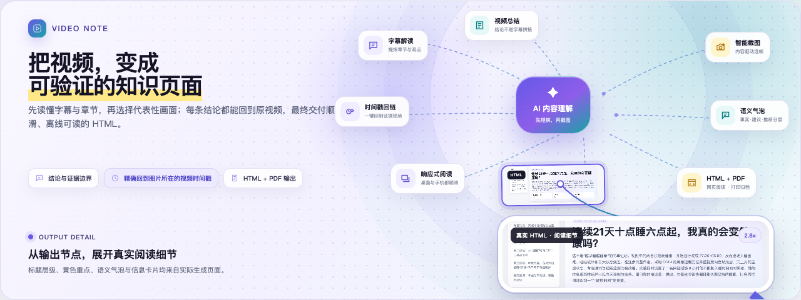
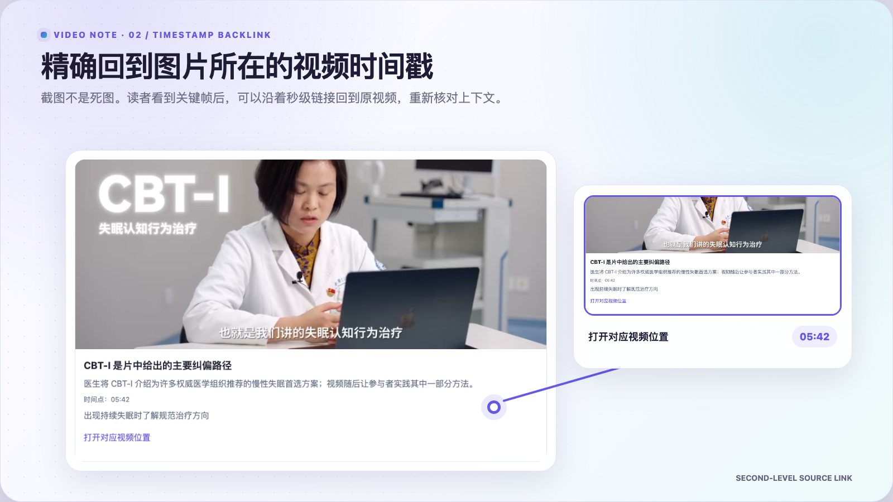
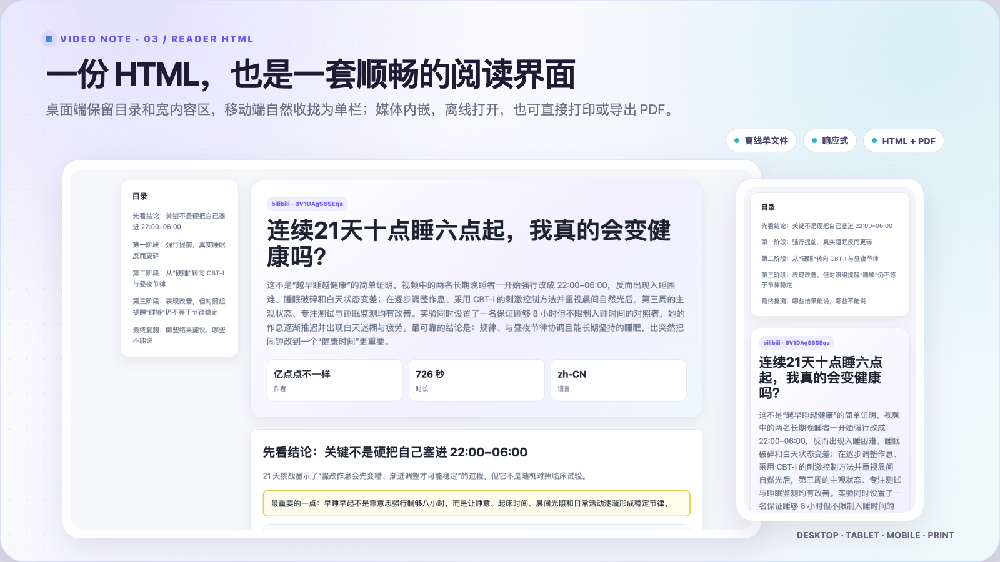
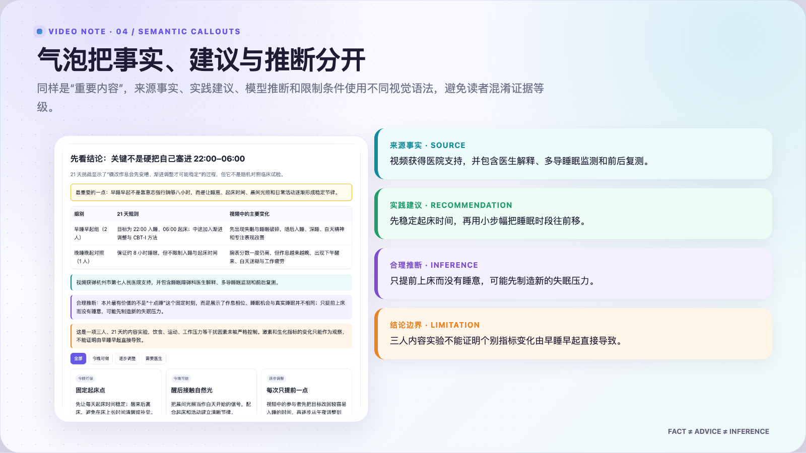
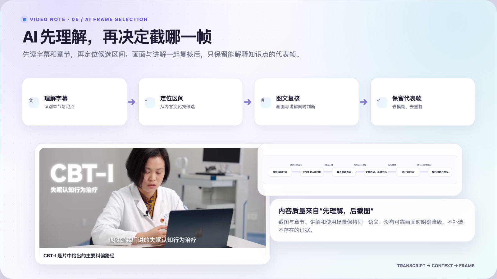
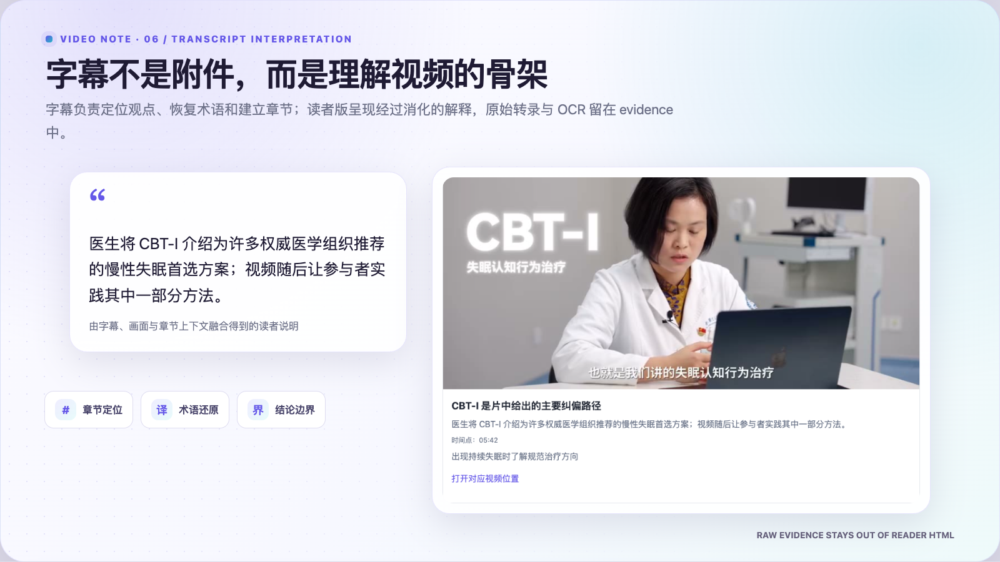
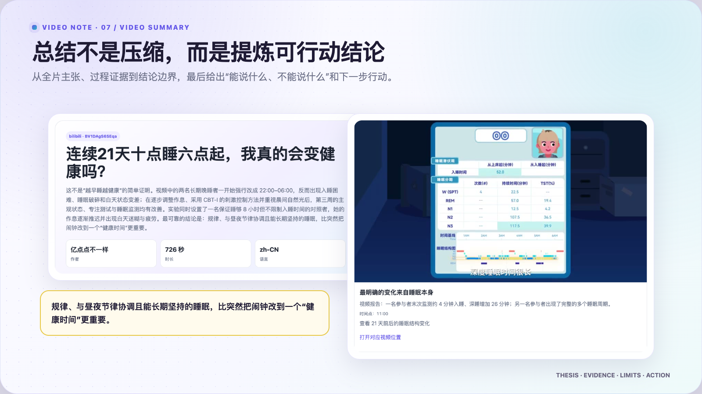
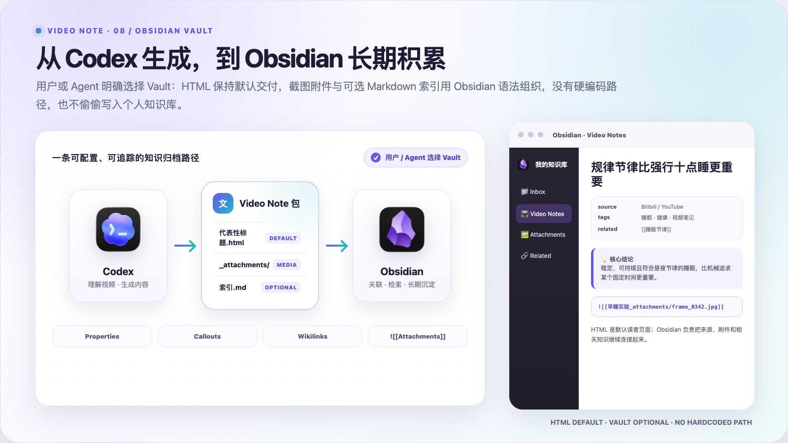

<p align="center">
  
</p>

<p align="center">
  <a href="#功能展示">功能展示</a> ·
  <a href="#obsidian-workflow">Obsidian</a> ·
  <a href="#工作流">工作流</a> ·
  <a href="#快速开始">快速开始</a> ·
  <a href="#html-与-pdf">HTML 与 PDF</a> ·
  <a href="#隐私与安全">隐私与安全</a>
</p>

<h1 align="center">youtube-to-obsidian</h1>

<h3 align="center">把 YouTube 视频，变成可验证、可回链、可离线阅读的知识页面。</h3>

<p align="center">
  先理解字幕和章节，再选择代表画面；每条关键结论都能回到原视频。
</p>

<p align="center">
  
  
  
  
  
  
</p>

`youtube-to-obsidian` 是一个可部署到 Codex 或 Hermes 的视频笔记 Skill，也是一套
独立的字幕提取、HTML 渲染与验收工具。它把字幕、时间戳、代表画面与内容解释
组织成真正适合阅读的单文件 HTML，而不是把逐字稿简单套进模板。

> 本页功能画面取自真实 Bilibili 视频笔记输出；YouTube Skill 使用同一套
> `video-note/v2` 语义契约、HTML 渲染器与视觉语言。

## 功能展示

### 1. 视频截图：从内容切换点寻找代表画面

<p align="center">
  
</p>

截图不是装饰。Agent 或宿主工作流先根据字幕时间轴找出步骤、界面、代码、配置、
对比和结果等内容切换点，再审查候选帧。最终图片被嵌入 HTML，即使把文件移动
到空目录，仍能离线显示。

- 截图数量由解释价值决定，不按固定间隔机械抽帧。
- 每张图都应说明它支持了哪一条结论。
- 支持 JPEG、PNG、WebP；缺图或格式不受支持时明确失败。

### 2. 时间戳回链：精确回到图片所在的视频时间戳

<p align="center">
  
</p>

每张代表画面都保留秒级时间戳与原视频 URL。点击时间标签，可直接打开 YouTube
对应位置，重新核对前后语境。总结因此不再是无法追溯的二手结论，而是一张能够
回到来源的阅读地图。

### 3. 顺畅的 HTML：从大屏阅读到手机查看

<p align="center">
  
</p>

输出不是普通长文章，而是一套为视频内容设计的响应式阅读界面：桌面端使用粘性
章节导航，平板和手机自动重排；卡片、表格、图片和代码都不会突破页面宽度。

- 单文件、图片内嵌、运行时不依赖网络。
- 提供章节导航、筛选、折叠、复制和键盘操作。
- 固定验证 1440、1024、768、390 四种视口。
- 390px 手机视口必须无横向溢出。

### 4. 语义气泡：一眼分清事实、建议和推断

<p align="center">
  
</p>

同一句“看起来合理”的话，可能来自视频原文，也可能是整理后的建议或模型推断。
Skill 用稳定的颜色与标签把它们分开：

| 类型 | 用途 |
|---|---|
| 来源信息 | 视频明确表达、可回到时间戳核对的内容 |
| 实用建议 | 根据内容整理出的可执行做法 |
| 推断与创新 | 超出原话、但有推理依据的扩展 |
| 限制提示 | 数据不足、适用范围或降级说明 |

这种区分也会保留在打印版本中，不靠颜色之外的单一线索表达含义。

### 5. AI 先解读，再截图

<p align="center">
  
</p>

Agent 或宿主应先读字幕、划分章节并理解每一部分要回答的问题，再从内容切换点
选择候选画面，并按需用视觉模型或 OCR 复核。这样得到的是能够支持解释的图片，
而不是均匀分布但缺少语义的截图。

仓库提供字幕工具、公开 schema、渲染器、归档器和验收脚本；它目前不捆绑一个
“输入 URL 后自动完成全部模型调用”的单命令编排器。README 不会把宿主 Agent
的能力冒充为仓库内置功能。

### 6. 字幕解读：优先复用现有字幕，失败时明确降级

<p align="center">
  
</p>

字幕获取采用明确的降级链：`youtube-transcript-api` → `yt-dlp` 人工字幕 →
`yt-dlp` 自动字幕 → 本地 Whisper → 仅标题和描述的降级摘要。Agent 把字幕
整理成章节、关键观点与使用场景，同时把原始证据留在 `evidence.json`。

读者 HTML 只呈现整理后的解释。`raw_subtitles`、`ocr_text`、`confidence`、
`grounding` 等证据字段会被自动测试，确保不泄漏进页面源码。

### 7. 视频总结：回答“讲了什么、为什么重要、何时使用”

<p align="center">
  
</p>

最终总结不是逐句缩写，而是围绕主题建立清楚的因果结构：先给出核心判断，再解释
依据、适用条件和实践建议。归档时，Agent 会根据整篇内容生成能代表主题与主要
结论的标题，而不是沿用“video ID 总结”之类的机械文件名。

<a id="obsidian-workflow"></a>

### 8. Obsidian 集成：从一次性交付到长期知识库

<p align="center">
  
</p>

HTML 解决一次阅读，Obsidian 负责长期积累。当用户或 Agent 明确选择 Vault
或其子目录后，Skill 可以把已验收页面、代表截图和可选 Markdown 索引放进同一套
知识结构；没有配置时不会猜测路径，也不会偷偷写入个人知识库。

- 截图进入独立的 `<标题>_attachments/`，Markdown 使用
  `![[附件文件]]`，让 Obsidian 正确显示并追踪 Vault 内图片。
- 可选索引使用 YAML Properties 保存 `title`、`source`、`tags`、`related`
  等元数据，用 callouts 突出结论，用 wikilinks 连接相关主题。
- 已验收 Web HTML 仍是默认读者交付物；Obsidian 是可选的归档、索引和关联层，
  不是对 HTML 的替代。
- 不再额外生成 `.canvas` 导图。HTML 已承担完整信息结构，避免同一内容维护两套
  容易分叉的展示文件。

```text
Codex → 字幕 / 截图 / 总结 → HTML + attachments
                                  │
                                  └─ 用户明确选择 Vault
                                      → Properties
                                      → Callouts
                                      → Wikilinks
```

## 工作流

```text
YouTube URL
    │
    ├─ 字幕：youtube-transcript-api → yt-dlp → Whisper → 明确降级
    ├─ 理解：字幕时间轴 → 章节 → 每章要回答的问题
    ├─ 画面：内容切换点 → 候选帧 → 可选视觉 / OCR 复核
    └─ 证据：时间戳、来源、OCR、覆盖度单独保存
                         │
                         ▼
            note.json + evidence.json
                         │
                         ├─ Web HTML：离线、响应式、可交互
                         └─ Email HTML：静态、展开、无 JavaScript
                         │
                         ▼
          浏览器验收 → 打印 / PDF → 代表性标题归档
```

典型输出：

```text
output/
├── transcript.json    # 带时间戳字幕
├── note.json          # 面向读者的 video-note/v2
├── evidence.json      # 原始字幕、OCR、时间对齐与覆盖证据
├── note.html          # Web profile
├── email.html         # 可选 Email profile
└── media/             # 构建图片；最终 HTML 会内嵌
```

## 快速开始

要求 Python 3.11+、[uv](https://docs.astral.sh/uv/)；视频处理或 Whisper 兜底
还需要 `ffmpeg`。

```bash
git clone https://github.com/ezbug/youtube-to-obsidian.git
cd youtube-to-obsidian
uv sync --frozen

./scripts/install.sh --target codex --mode symlink
./scripts/doctor.sh
```

提取字幕：

```bash
uv run python scripts/extract_subtitles.py '<YouTube URL>' \
  --lang 'en,zh-CN' \
  --format srt
```

只获取自动字幕时添加 `--auto`。公开元数据可以通过以下命令读取：

```bash
uv run yt-dlp --dump-json --no-download '<YouTube URL>'
```

随后由 Agent 或宿主把字幕、元数据和经验证的画面整理成 `video-note/v2`
`note.json`。最小与完整示例分别位于
`tests/fixtures/video-note-v2/minimal.json` 和
`tests/fixtures/video-note-v2/all-blocks.json`。

按需安装 OCR、Whisper 或全部可选能力：

```bash
uv sync --frozen --extra ocr
uv sync --frozen --extra whisper
uv sync --frozen --extra full
```

## HTML 与 PDF

生成离线 Web HTML：

```bash
uv run python scripts/render_html.py \
  --note '<构建目录>/note.json' \
  --output '<构建目录>/note.html' \
  --profile web
```

生成无 JavaScript、内容全部展开的 Email HTML：

```bash
uv run python scripts/render_html.py \
  --note '<构建目录>/note.json' \
  --output '<构建目录>/email.html' \
  --profile email
```

打开 Web HTML 后，可通过浏览器“打印 → 存储为 PDF”生成 A4 PDF。项目的验收脚本
也会用 Playwright 生成 A4、四边 12mm、保留背景色的打印证据。目前没有独立的
`--pdf` 渲染命令。

归档使用内容生成的代表性标题：

```bash
uv run python scripts/archive_html.py \
  --html '<构建目录>/note.html' \
  --title '<代表性标题>' \
  --source-id '<YouTube video ID>' \
  --archive-dir '<用户选择的目录>'
```

目录可以由 `--archive-dir`、`VIDEO_NOTE_ARCHIVE_DIR`、JSON 配置或 Agent
明确设定；仓库不写死作者电脑路径。

<details>
<summary><strong>video-note/v2 与 Web / Email profile</strong></summary>

`video-note/v2` 支持段落、列表、callout、状态卡、特性卡、动态表格、代码块、
renderer-owned SVG、图片和 accordion。未知字段默认拒绝。

Web profile 提供粘性导航、筛选、accordion、复制按钮与 `aria-live` 反馈。
Email profile 面向 Apple Mail 16+ 与静态 HTML 预览，不包含 JavaScript、
sticky、交互按钮、外部样式或外部图片，所有内容直接展开。

</details>

<details>
<summary><strong>Golden HTML、浏览器验收与跨仓库一致性</strong></summary>

`references/html-golden/` 是只读视觉基线，实测设计 token 位于
`references/html-design-analysis.md`。渲染器有意修复了 golden reference 的
390px 溢出、favicon 请求和复制反馈不持久三个问题。

```bash
uv run --extra dev pytest -q
uv run --extra dev python scripts/acceptance_check.py
```

验收覆盖 1440、1024、768、390 视口，以及零 console/page error、零失败请求、
键盘操作、可见焦点、离线重载、图片内嵌和 A4 打印。

YouTube 与 Bilibili Skill 允许内部实现不同，但 schema、normalized semantic
model、HTML 设计 token、Web/Email profile、安全策略、错误语义与验收结果必须
等价。平台差异只能出现在来源 URL、badge、作者等元数据中。

</details>

## 隐私与安全

- 仓库不包含个人路径、Vault 位置、API Key、Cookie、邮箱认证或运行产物。
- `.env.example` 只列出可用变量名；不要提交包含真实密钥的 `.env`。
- Cookie 文件只能由用户显式提供；Agent 不读取浏览器 Cookie 数据库。
- 用户文本与属性始终转义，只允许 `http`、`https` 和验证后的内嵌资源。
- 用户 HTML、用户 SVG、危险 URL scheme、未知字段和缺失图片会被拒绝。
- `note.json` 面向读者，`evidence.json` 保存原始字幕、OCR 和模型证据。
- 最终目录由用户或 Agent 设置；本地 `archive-config.local.json` 被 Git 忽略。
- 邮件默认不发送，必须由用户明确要求并显式执行。

## 已知边界

- YouTube 接口、SABR、限流、地区限制和登录要求会随平台变化。
- Whisper、OCR、视觉分析、PPT 和邮件属于可选增强，不是默认成功条件。
- 仓库没有单一的全自动模型编排器；Agent 或宿主负责生成经过证据约束的
  `note.json`。
- 没有字幕、画面或来源证据时必须说明降级，不得伪装成完整视频分析。
- 更细的 Agent 规则、字幕优先级和历史兼容说明见 [`SKILL.md`](SKILL.md)。
